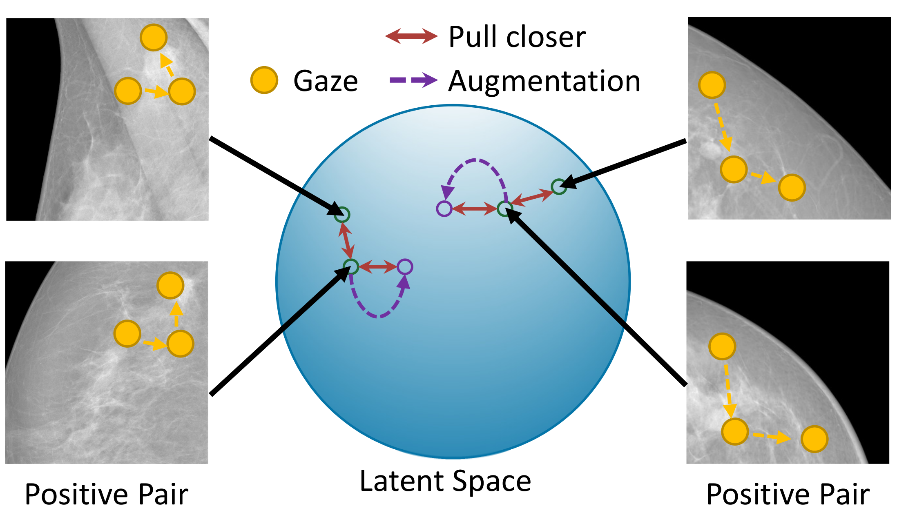
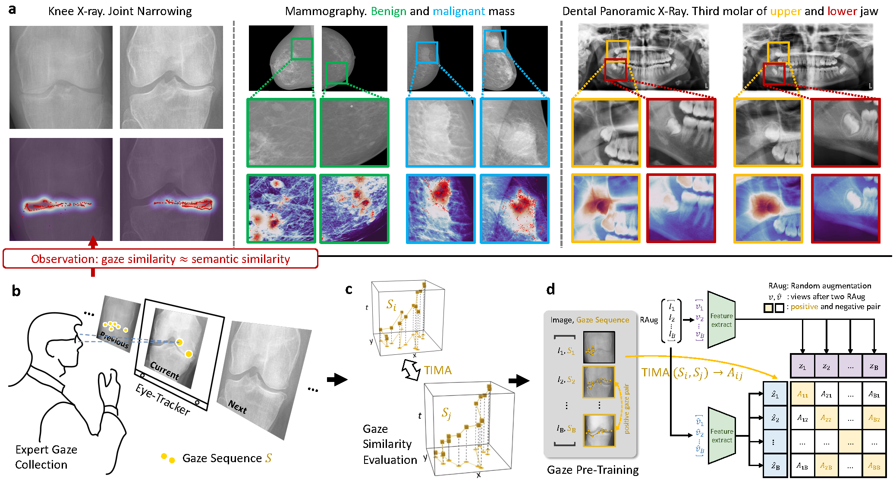

# [AAAI 2024] Mining Gaze for Contrastive Learning toward Computer-assisted Diagnosis

by Zihao Zhao\*, Sheng Wang\*, Qian Wang, Dinggang Shen<br/>

<!-- <div style="display: flex; justify-content: center; align-items: center;">
    
</div> -->

<div align="center">
  
</div>
<!-- <p style="align-self: flex-start;">The illustration of our proposed McGIP. For contrastive pre-training, a positive pair is typically only constructed between a image and its augmented version. In our McGIP, the images with similar gaze patterns when read by a radiologist are also considered as positive pairs and be pulled closer in the latent space.</p> -->

> <p align="justify"> 
> The illustration of our proposed McGIP. For contrastive pre-training, a positive pair is typically only constructed between a image and its augmented version. In our McGIP, the images with similar gaze patterns when diagnosed by a radiologist are also considered as positive pairs and be pulled closer in the latent space.

</p>

# [Under Review] Early Alignment in Self-Supervised Medical Imaging Pre-Training Using Human Eye Gaze

by Sheng Wang\*, Zihao Zhao\*, Zhenrong Shen, Bin Wang, Qian Wang, Dinggang Shen<br/>

<!-- <div style="display: flex; justify-content: center; align-items: center;">
    
</div> -->

<div align="center">
  
</div>

> <p align="justify"> 
> Illustration of our proposed framework. (a) Examples showing images of similar semantics often with similar gaze patterns. In the left, there are two knee X-rays, both showing joint narrowing and corresponding similar gaze. In the middle, there are four breast mammography images, among which two are benign masses (green boxes) and other two are malign (blue boxes). The distributions of gaze points are similar across two benign masses, and also similar across two malign masses. In the right, there are two dental X-ray images of different patients. The yellow and red boxes indicate wisdom teeth on the upper and lower jaws, respectively. Across two images, the teeth of the same location have similar gaze heatmaps, corresponding to their shared anatomical roles and common underlying image semantics. (b) Gaze collection with an eye-tracker placing below radiologist's monitor. (c) The proposed Temporal Image Moment Analysis (TIMA) algorithm for evaluating radiologist's gaze similarity. (d) Gaze Pre-training (GzPT), where images with similar gaze are regarded as positive pairs in contrastive learning and thus pulled together in the latent space.

## </p>

## Introduction

In this paper, we introduce a plug-and-play module called McGIP. This module efficiently constructs positive sample pairs for contrastive learning in medical image analysis based on Gaze similarity.

- We provide the code for integrating McGIP into the contrastive learning framework, available at [here](code/Contrastive+McGIP).
- Furthermore, we offer code to evaluate different schemes for comparing gaze similarity in medical images, available at [here](code/GazeSimilarityEval/).

This integration enhances the performance of contrastive learning, leading to improved results.

## Usage

This repository contains the following:

1. **Contrastive+McGIP**: You can find modified code of contrastive learning with McGIP under this folder. These codes demonstrate how to incorporate McGIP into an existing contrastive learning framework to achieve superior performance. we conduct experiments under mmselfsup 0.x environments. The main difference is shown in function self.\_create_buffer(N, idx_list)

2. **GazeSimilarityEval**: We provide code implementations to measure gaze similarity under different scenarios. We designed different schemes tailored to various gaze data formats (i.e., gaze sequence and gaze heatmap) and situations (i.e., unstructured and structured images) in medical image analysis.

## Citation

```
@article{zhao2023mining,
      title={Mining Gaze for Contrastive Learning toward Computer-Assisted Diagnosis},
      author={Zihao Zhao and Sheng Wang and Qian Wang and Dinggang Shen},
      journal={arXiv preprint arXiv:2312.06069},
      year={2023},
}
```

## Acknowledgement

This experiments are conducted on the basis of [mmselfsup 0.x](https://github.com/open-mmlab/mmselfsup/tree/0.x), thanks for their contributors.
