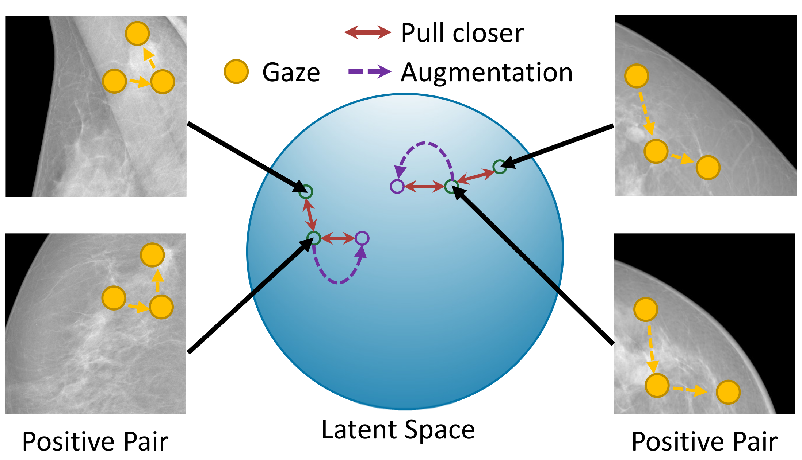

# McGIP

[AAAI 2024] Mining Gaze for Contrastive Learning toward Computer-assisted Diagnosis

    

The illustration of our proposed McGIP. For contrastive pre-training, a positive pair is typically only constructed between a image and its augmented version. In our McGIP, the images with similar gaze patterns when read by a radiologist are also considered as positive pairs and be pulled closer in the latent space.

